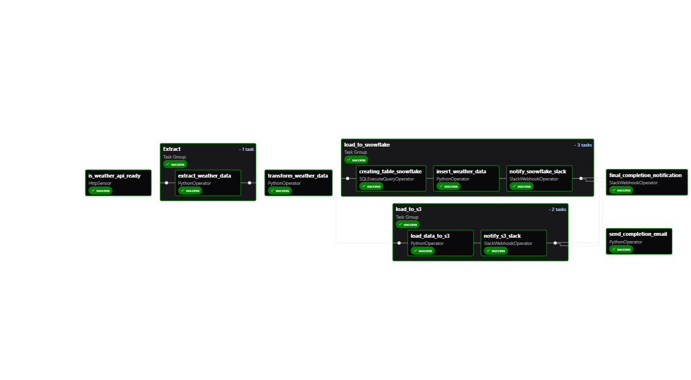

# DataForge: The DataOps Pipeline 🚀🌦️

## 🌐 Overview

DataForge is a scalable, modular, and production-grade **ETL pipeline** for ingesting and processing weather data from external APIs. Built using **Apache Airflow**, it integrates cloud storage (Amazon S3), a modern data warehouse (Snowflake), and notification systems (Slack + Email).


## ✅ Current Features

- **Sensor-based pipeline trigger** (via `HttpSensor`) to check API availability.
- **Data extraction** from external weather APIs.
- **Transformation** of raw weather data into structured formats.
- **Data loading** into:
  - 📄 **Amazon S3** (for archiving & future batch analytics)
  - 🧊 **Snowflake** (for real-time querying and warehousing)
- **Slack notifications** on:
  - Snowflake and S3 completion
  - Final pipeline success
- **Email alerts** for:
  - Completion notification
  - Failures and retries
- Modular task groups: `Extract`, `Transform`, `Load to Snowflake`, `Load to S3`
- Fully **visual DAG** orchestration with success-state tracking



---

## 🚧 Future Plans (Work in Progress)

| Feature | Description |
|--------|-------------|
| 📊 Dashboards | Interactive Streamlit or React-based dashboards for monitoring weather metrics |
| 🧬 ML Integration | Add predictive models (e.g., rainfall forecasting) |
| 🗂 AWS EMR Support | Support for big data processing (CSV → Parquet → Hive tables) |
| 🧪 Unit Testing & CI/CD | Automated testing using `pytest`, CI/CD with GitHub Actions |
| 🔐 Secrets Management | Switch from plain-text SMTP to AWS Secrets Manager or HashiCorp Vault |
| 🧠 Real-time Monitoring | Integrate Prometheus + Grafana to monitor pipeline health |
| 🧰 Plugin Support | Custom Airflow plugins for extensibility |

---

## 🛠️ Technologies Used

- **Apache Airflow** (`v2.x`)
- **Snowflake** (via Airflow's `SnowflakeHook`)
- **Amazon S3** (`boto3`)
- **Slack** (`SlackWebhookOperator`)
- **SMTP/Email** (Gmail or AWS SES)
- **Python 3.12+**

---


## ⚙️ Getting Started

### 🚀 Installation

> **Note:** This project is compatible only with **Linux-based operating systems** or environments that emulate them, such as **WSL (Windows Subsystem for Linux)** on Windows.

```bash
# Clone the repository
git clone https://github.com/Sumit-Dwivedi/dataforge-pipeline
cd dataforge-pipeline

# Create and activate a virtual environment
python3 -m venv airflow-venv
source airflow-venv/bin/activate

# Install all required dependencies
pip install -r requirements.txt
```
## ▶️ Running the Project

### 1. Configure Airflow DAGs directory

Set the `dags_folder` path in the `airflow.cfg` file to point to your local `dags/` directory.

### 2. Activate your virtual environment

If not already active, run:

```bash
source airflow-venv/bin/activate
```

### 3. Start Airflow in standalone mode

Launch the webserver and scheduler with:

```bash
airflow standalone
```

### 4. Access the Airflow UI

Open your browser and navigate to:

👉 [http://localhost:8080](http://localhost:8080)

## Author

- [@Sumit-Dwivedi](https://github.com/Sumit-Dwivedi)

